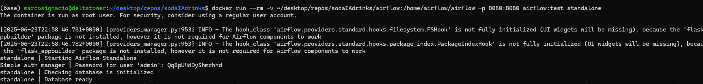

docker run -it --rm --entrypoint /bin/bash airflow:test

# para rrealiza pruebas unicmaent econ airflow. sin integracion
docker run -it --rm -p 8080:8080 -v "$PWD":/home/airflow airflow:test standalone

--- update ----
luego de construir la imagen docker. al ingresar a airflow el usuario y contraseña se muestran en consola

docker run -it --rm --entrypoint /bin/bash airflow:test

