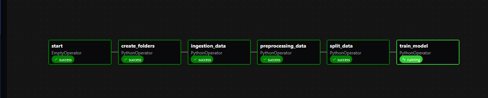

# Airflow DAG - MODEL_DAG

## Descripción

El DAG principal de este proyecto, llamado **MODEL_DAG**, coordina todo el flujo de procesamiento y entrenamiento del modelo de predicción de compras semanales.

## Tareas del Pipeline

### 🚀 `start`
- **Tipo**: EmptyOperator
- **Propósito**: Marca el inicio del flujo de trabajo

### 📁 `create_folders`
- **Función**: Crea la estructura de carpetas necesarias
- **Organización**: Guarda datos por fecha de ejecución
- **Estructura**:
  - `/runs/FECHA/raw_data/` - Datos sin procesar
  - `/runs/FECHA/preprocessed_data/` - Datos preprocesados
  - `/runs/FECHA/splits_data/` - Conjuntos train/val/test
  - `/runs/FECHA/models/` - Modelos entrenados

### 📥 `ingestion_data`
- **Función**: Carga los datasets originales
- **Datasets**: 
  - `clientes.parquet`
  - `productos.parquet` 
  - `transacciones.parquet`
- **Salida**: Rutas almacenadas en XCom para uso posterior

### 🔧 `preprocessing_data`
- **Función**: Aplica limpieza y transformación de datos
- **Procesos**:
  - ✅ Limpia y balancea transacciones (`df_transacciones_clean`)
  - ✅ Elimina duplicados en clientes (`df_clientes_clean`)
  - ✅ Deduplica y mapea productos (`df_productos_clean`)
  - ✅ Genera dataset final fusionado (`df_completed.parquet`)
- **Ubicación**: `/runs/FECHA/preprocessed_data/`

### 📊 `split_data`
- **Función**: División del dataset en conjuntos de entrenamiento
- **Salida**: Conjuntos train/validation/test listos para modelado
- **Formato**: Archivos parquet separados

### 🤖 `train_model`
- **Función**: Entrenamiento del pipeline de Machine Learning
- **Características**:
  - 🔹 Enriquecimiento de features (agregados por semana, cliente, producto)
  - 🔹 Preprocesamiento numérico y categórico
  - 🔹 Entrenamiento con RandomForest en Pipeline scikit-learn
- **Salida**: Modelo serializado en `/runs/FECHA/models/trained_model.pkl`

## Diagrama del Flujo

El diagrama de flujo ilustra que el pipeline de entrenamiento es lineal. El DAG está configurado para cada 24 horas ejecutar el pipeline completo, asegurando que siempre se utilicen los datos más recientes y se guarde un nuevo modelo entrenado.

No se implementa el drift de datos.